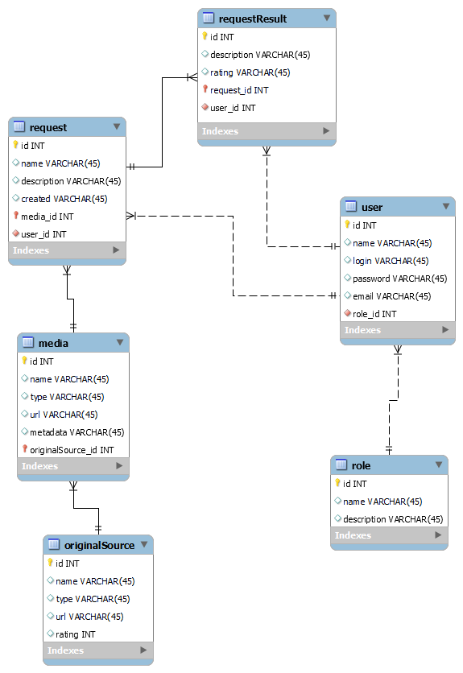

# Проєктування бази даних

## Модель бізнес-об'єктів 

@startuml

entity User  #FFFFFF
entity User.name #FFFFFF
entity User.login  #FFFFFF
entity User.password #FFFFFF
entity User.email #FFFFFF
entity User.id  #FFFFFF

User.name --* User
User.login --* User
User.password --* User
User.email --* User
User.id --* User

entity Role  #FFFFFF
entity Role.id  #FFFFFF
entity Role.name  #FFFFFF
entity Role.grants #FFFFFF

Role.id-u-* Role
Role.name-u-* Role
Role.description-u-* Role

entity Request

entity Request.id #FFFFFF
entity Request.description #FFFFFF
entity Request.name #FFFFFF
entity Request.time #FFFFFF

Request.id --* Request
Request.description --* Request
Request.name --* Request
Request.time --* Request

entity Media

entity Media.id #FFFFFF
entity Media.type #FFFFFF
entity Media.url  #FFFFFF
entity Media.name #FFFFFF
entity Media.metadata #FFFFFF

Media.id --* Media
Media.type --* Media
Media.url  --* Media
Media.name --* Media
Media.metadata --* Media

entity OriginalSource

entity OriginalSource.id #FFFFFF
entity OriginalSource.type #FFFFFF
entity OriginalSource.url #FFFFFF
entity OriginalSource.name #FFFFFF
entity OriginalSource.rating #FFFFFF

OriginalSource.id --* OriginalSource
OriginalSource.type --* OriginalSource
OriginalSource.url --* OriginalSource
OriginalSource.name --* OriginalSource
OriginalSource.rating --* OriginalSource

OriginalSource "1,1"---"0,*" Media

Media "1,1 "---"1, *" Request

entity RequestResult

entity RequestResult.description #FFFFFF
entity RequestResult.id #FFFFFF
entity RequestResult.rating #FFFFFF

RequestResult.description --* RequestResult
RequestResult.id --* RequestResult
RequestResult.rating --* RequestResult

Request "1,1 "-"0, *" RequestResult
User "1, 1" -r- "0, *" Request
User "0, *"--"1,1" Role

@enduml

## ER-модель

@startuml

!define USER_COLOR #5F6DD2
!define MEDIA_COLOR #DB3E50
!define ALT_COLOR #51AF51

entity "OriginalSource" as Source <<E, MEDIA_COLOR>> {
+id: Number
+name: Text
+type: Text
+url: Text
+rating: Number
}

entity Media <<E, MEDIA_COLOR>> {
+id: Number
+name: Text
+type: Text
+url: Text
+metadata: Text
}

entity Role <<ENUMERATION>> <<E, USER_COLOR>> {
+id: Number
+name: Text
+description: Text
}

entity User <<E, USER_COLOR>> {
+id: Number
+name: Text
+login: Text
+password: Text
+email: Text
}

entity Request <<E, ALT_COLOR>> {
+id: Number
+name: Text
+description: Text
+created: Date
}

entity "RequestResult" as Rqresult <<E, ALT_COLOR>> {
+id: Number
+description: Text
+rating: Number
}

Media "0,*" --> "1,1" Source
Request "1,*" --> "1,1" Media
Rqresult "0,*" --> "1,1" Request
Rqresult "0,*" --> "1,1" User
Request "0,*" -r-> "1,1" User
User "0,*" -d-> "1,1" Role

@enduml

## Реляційна схема

  

